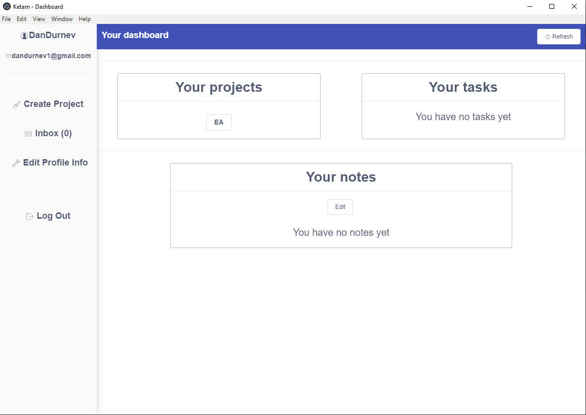

# ketarnio desktop

this is a desktop version of [ketarn](https://github.com/danmoop/Ketarn) built with Vue & Electron with a rest [backend](https://github.com/danmoop/ketarnio_server) built on Spring
<<<<<<< HEAD

=======
>>>>>>> b3a430416f0a36a00353a29e84f08d1539cc7ac8
